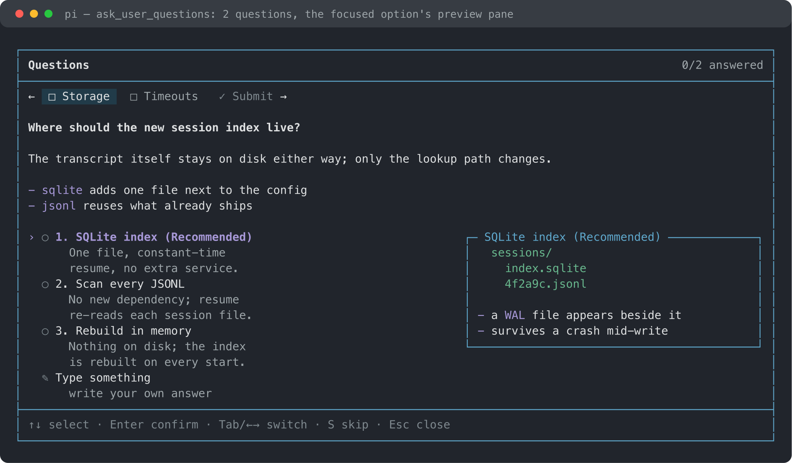
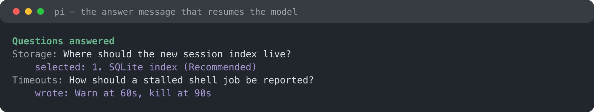
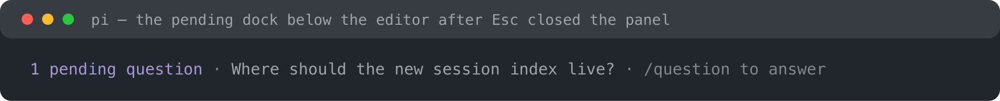

# Lune Ask Question

[](LICENSE)

**Structured questions for [Pi](https://pi.dev): the model asks, the panel opens, and the answers come back as a follow-up message.**

`ask_user_questions` is for the decisions the model should not make on its own. The tool returns as soon as the panel is open, so the agent keeps working on what it is sure about and your answer resumes it later instead of blocking the turn.



## Quick start

Install from git:

```bash
pi install git:github.com/Nouvelle-Lune/lune-ask-question
```

Then start Pi normally:

```bash
pi
```

There is nothing to enter and no mode to switch: when the model needs a decision it calls `ask_user_questions`, and the panel opens over the session.

## What it does

- **Opens the panel on arrival.** The overlay appears as soon as the tool call is made, so the question is answered while the model is still thinking rather than at the end of the turn.
- **Answers as a follow-up message.** Answering or skipping sends one message back to the model (`triggerTurn`, delivered as a steer), rendered in the transcript as a `Questions answered` or `Questions skipped` row.
- **Keeps unanswered questions reachable.** `Esc` closes the panel without settling anything, a dock below the editor says a question is still pending, and `/question` reopens the next one with its focus and written drafts intact.
- **Survives a restart.** Pending questions and drafts are snapshotted into the session and restored from the active branch, so `/reload`, `/resume` and `/tree` switches do not lose a question.
- **Compares options before answering.** An option's Markdown `preview` renders in a bordered pane beside the options - side by side on a wide terminal, stacked under them on a narrow one - and is never echoed into the answer.
- **Only as tall as its content.** A short question covers as little of the transcript as possible; a long one scrolls, with the tab strip pinned above the body.

## Panel

| Key | |
| --- | --- |
| `↑` `↓`, `k` `j` | Move between option rows |
| `Enter` | Confirm the focused row - on a submit row it submits |
| `Space` | Toggle the focused option in a multi-select question |
| `1`–`9` | Pick an option by number |
| `Tab`, `⇧Tab`, `←` `→` | Switch question tabs and the `✓ Submit` tab |
| Any printable key on `Type something` | Open the answer editor with that key |
| `Enter` in the editor | Submit the written answer |
| `Esc` in the editor | Back to the options, keeping the draft |
| `Esc` | Close the panel and leave the request pending |
| `s` | Skip the whole request |

A single-question request submits on the option press. Several questions walk through their tabs and meet on the `✓ Submit` tab, and submitting with a gap jumps to the first unanswered question instead of doing nothing.

Answers land in the transcript and resume the model:



## Pending questions

`Esc` is a defer, not a dismissal: the panel closes, the request stays pending, and the dock under the editor says which question `/question` would show next.



The panel picks the least recently shown pending request, so a question that just arrived surfaces immediately while a request that was only deferred waits its turn. A request that arrives while a panel is open does not need `/question`: answering the current one hands the panel over to the next.

## Agent-facing tool

`ask_user_questions` is model-only and runs sequentially, so two calls cannot mutate the shared panel at once.

| Field | |
| --- | --- |
| `questions[].question` | A single-sentence, atomic decision prompt |
| `questions[].header` | Short subject label (`Storage`, `Auth`, `Timeouts`) shown as the tab label |
| `questions[].displayText` | Optional Markdown context above the answer controls, such as a preview or a snippet |
| `questions[].options[]` | Two to four mutually distinct choices; omit the field for free-form input |
| `questions[].options[].label` | Short choice label; put the preferred option first with `(Recommended)` |
| `questions[].options[].description` | One sentence on the consequence or tradeoff |
| `questions[].options[].preview` | Optional Markdown for the comparison pane, roughly a dozen lines |
| `questions[].multiSelect` | Whether several options can apply together |

At most four questions per request, and the model is told to ask the smallest set that unblocks it: inspect first, use a reasonable default for low-impact choices, and only stop when progress depends on the answer.

Outside the interactive TUI the tool does not wait for an answer that can never arrive; it reports that the question must be asked in plain text instead.

## Development

```bash
npm install
npm test
npm run typecheck
npm run tui:demo          # real pi TUI, scripted model, one question
LAQ_DEMO=two npm run tui:demo   # queue a second request to watch the handover
LAQ_DEMO=multi npm run tui:demo # one request with three questions, to watch the tabs
npm run docs:images       # regenerate docs/*.svg + docs/*.png (needs rsvg-convert)
```

`docs:images` renders the README screenshots from the real panel, dock and answer-row components against Pi's dark theme palette, so a UI change is one command away from an up-to-date image.

`@earendil-works/pi-coding-agent`, `@earendil-works/pi-tui` and `typebox` are supplied by the Pi host at runtime, so the package declares them as `peerDependencies` with a `"*"` range and never bundles them. They are repeated in `devDependencies` so local typecheck and tests resolve the same modules Pi injects.

## License

MIT
